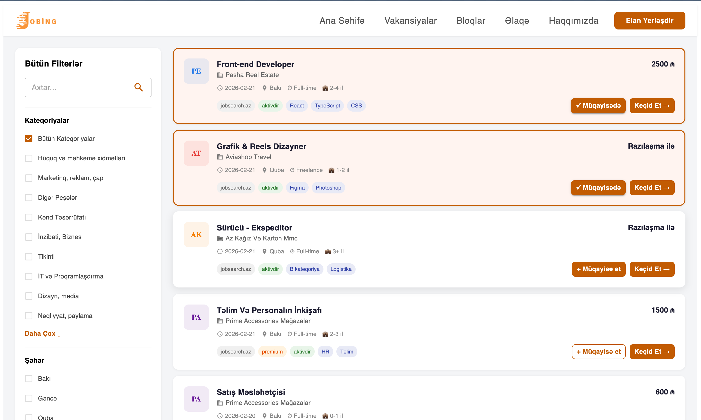
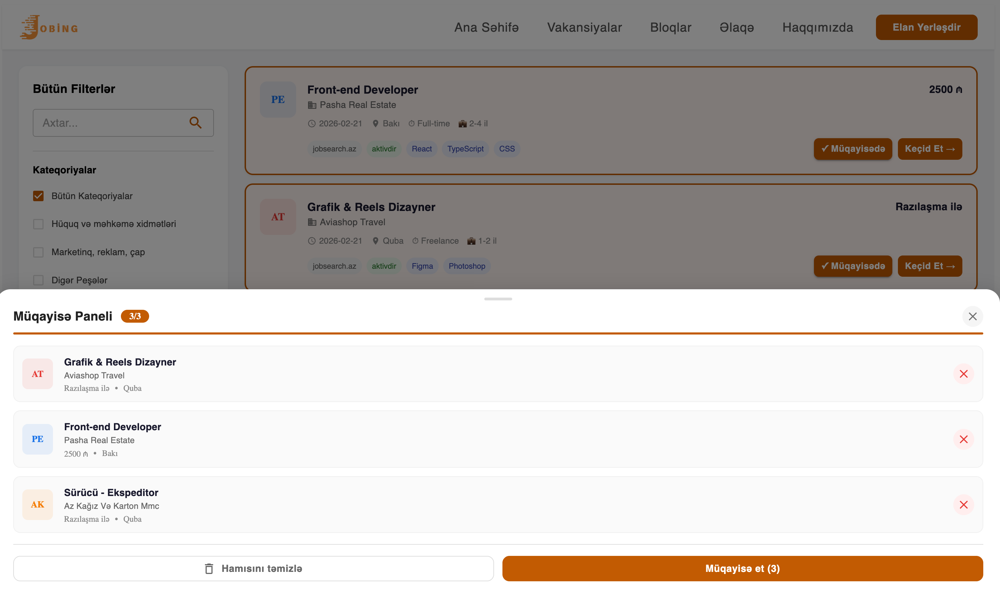

# Jobing.az — Müqayisə Paneli (Comparison Drawer)

Jobing.az platforması üçün hazırlanmış interaktiv vakansiya müqayisə modulu.






## Features

- ✅ Vakansiyaları müqayisəyə əlavə et (maks. 3)
- ✅ 4-cü vakansiya seçildikdə xəbərdarlıq bildirişi
- ✅ Tək-tək silmə və "Hamısını təmizlə"
- ✅ Səhifə refresh-dən sonra seçimlər qalır (localStorage)
- ✅ Aşağıdan açılan Drawer paneli
- ✅ Toast bildirişləri
- ✅ Responsive dizayn (mobil və desktop)

## Technologies

- React 19
- Material UI (MUI)
- Vite
- localStorage (state management)

## Installation
```bash
git clone https://github.com/elman17/jobing-comparison.git
cd jobing-comparison
npm install
npm run dev
```

## Layihə Strukturu
```
src/
├── components/
│   ├── Navbar.jsx
│   ├── Layout.jsx
│   ├── Sidebar.jsx
│   ├── JobCard.jsx
│   ├── ComparisonDrawer.jsx
│   └── Toast.jsx
├── hooks/
│   ├── useComparison.js
│   └── useToast.js
├── assets/
│   ├── img_1.png
│   └── img_2.png
├── data.js
└── App.jsx
```

**Hazırladı:** Almaz Muradov